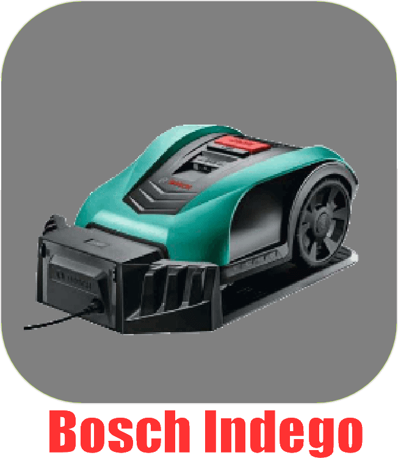

# BoschIndego - Plugin pour Jeedom

Commande et surveillance des robots tondeuse Bosch Indego.

## Changelog

>*Remarque : en cas de mise à jour non listée ici, c'est que celle-ci ne comporte que des changements mineurs du type documentation ou corrections de bugs mineurs.*

### 09/10/2021
- Correction de l'action Retour station. Changement de returntodock en returnToDock.
- Correction des fonctions cron et cronDaily ( static )

### 01/12/2020
- Ajout de l'étiquette compatibilité v4.
- v4 Correction de la taille de la carte du terrain pour Chrome.
- v4 Ajout de la possibilité de faire tourner la carte avec le paramètre optionnel rotateSvg L'angle est en degré.

### 24/03/2020
- Changement de l'icone.

### 13/03/2020
- Ajout de widgets pour la v4.
- Ajout en Beta sur le market.

### 22/05/2019
- Première version (Beta).

*[Documentation](index.md)*
