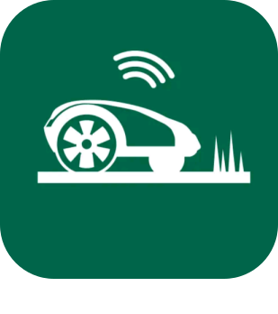

# BoschIndego - Plugin pour Jeedom

Commande et surveillance des robots tondeuse Bosch Indego.

## Changelog

>*Remarque : en cas de mise à jour non listée ici, c'est que celle-ci ne comporte que des changements mineurs du type documentation ou corrections de bugs mineurs.*

### 13/03/2020
- Ajout de widgets pour la v4.
- Ajout en Beta sur le market.

### 22/05/2019
- Première version (Beta).

*[Documentation](index.md)*
