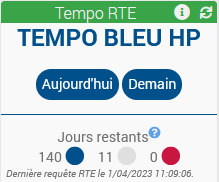
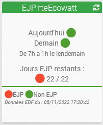

# Rte Ecowatt - Plugin pour Jeedom

Plugin utilisant les API Rte Ecowatt et Tempo pour extraire les données.

> Pour une procédure d'installation plus détaillée, voir le site [MiniProjets.net](https://miniprojets.net/index.php/2022/10/13/plugin-rteecowatt-ou-comment-preparer-sa-domotique-a-la-reduction-denergie/) Merci à [Ferrader](https://community.jeedom.com/u/ferrader)

## Prérequis chez RTE pour Ecowatt, Tempo et Consommation

Le plugin nécessite un compte sur le site [**data.rte-france**](https://data.rte-france.com) Cliquez sur "Se connecter" pour la création d'un nouveau compte ou l'utilisation d'un compte existant.
- Sur cette page: [**API Ecowatt**](https://data.rte-france.com/catalog/-/api/consumption/Ecowatt/v4.0), cliquez sur "Abonnez-vous à l'API"
- Rattachez ensuite cette API à une application existante ou créez une nouvelle application.
- Pour utiliser Tempo, cliquez sur "Abonnez-vous à l'API" sur la page: [**API Tempo**](https://data.rte-france.com/catalog/-/api/consumption/Tempo-Like-Supply-Contract/v1.1) Rattachez cette API à la même application qu'Ecowatt.
- Pour utiliser Consommation, cliquez sur "Abonnez-vous à l'API" sur la page: [**API Consumption**](https://data.rte-france.com/catalog/-/api/consumption/Consumption/v1.2)) Rattachez cette API à la même application qu'Ecowatt.
- Dans la rubrique "Mes applications" cliquez sur votre application. En cliquant sur le bouton "Copier en base 64", vos ID client et ID secret encodés en base 64, pourront être collés dans la configuration du plugin. 

## Aucun prérequis pour EJP
Le plugin va chercher les infos EJP sur le site [**EDF**](https://particulier.edf.fr/fr/accueil/gestion-contrat/options/ejp.html).

## Configuration

Après installation du plugin, il vous suffit de l’activer.
Il apparaitra alors dans le menu *Plugins > Energie*
- Collez l'ID client et l'ID secret encodés en base64 dans la configuration du plugin.

## Utilisation
### Type Ecowatt (RTE):
Créez un équipement. L'affichage est mis à jour au début de chaque heure. Les données se synchronisent chaque heure par le cron dédié. Selon la fréquence à laquelle Rte mettra à jour ses données, (aujourd'hui, c'est une fois par jour car pas d'alerte ), il faudra peut-être corriger la tâche du cron dédié pour s'adapter. 

Utilisez la commande "Valeur maintenant" comme déclencheur de scénario pour créer des alertes ou faire des actions de réduction de votre consommation électrique. Les valeurs possibles de cette commande sont:
- 1 pour le niveau vert: Consommation normale
- 2 orange: Système électrique tendu. Les écogestes sont les bienvenus 
- 3 rouge: Système électrique très tendu. Coupures inévitables si nous ne baissons pas notre consommation 
- 0 uniquement pour le plugin quand il y a eu un problème de récupération ou quand la valeur n'est pas définie (Ex: la sandbox le 3 juin de 0h à 7h)

Apercu de 2 équipements Ecowatt:

Apercu des différents templates:

Les tuiles en mode demo permettent de tester vos scénarios avant l'arrivée des alertes réelles.

### Type Tempo (RTE):
Créez un équipement. Les données se synchronisent à 11 heures (Rte publie à 10h40) et en rattapage à 12h et 14h.

Les commandes pour les scénarios sont Aujourdhui et Demain.
Les valeurs possibles de ces 2 commandes sont: BLUE, WHITE, RED et UNDEFINED

Apercu de l'équipement Tempo:

### Type Ejp (EDF):
- Ce type d'équipement n'utilise pas d'API RTE. La source utilisée est le site Web d'EDF.
- 3 commandes: Aujourd'hui, demain et EJP restants. Les valeurs possibles pour Aujourd'hui et demain sont EJP, NOT_EJP, UNDEFINED, ERROR et OUT_OF_PERIOD.
- Le plugin interroge EDF à 1h(heure de fin d’un jour EJP), 6h(avant le début d’un jour EJP, 12h, 16h (heure où demain passe dans le plugin de Non défini à EJP ou Non EJP. Si c’est Non EJP ce n’est pas définitif et peut être changé jusqu'à 5h du matin), 17h, 19h et 22h.

Apercu de l'équipement Ejp:

### Type Consommation RTE
- Ce type d'équipememnt utilise l'API Consumtion de RTE. Voir les prérequis.
- Les commandes: Consommation réalisée et 3 commandes avec des prévisions de consommation
- Dans le titre de la fenétre, un lien vers le site [**éCO2mix**](https://www.rte-france.com/eco2mix).

Apercu de l'équipement Consommation aprés quelques jours de focntionnement le temps que les historiques des commandes se remplissent.

### Guides d'utilisation des APIs:
- [**Ecowatt**](https://data.rte-france.com/catalog/-/api/doc/user-guide/Ecowatt/4.0)
- [**Tempo**](https://data.rte-france.com/catalog/-/api/doc/user-guide/Tempo+Like+Supply+Contract/1.1)
- [**Consumption**](https://data.rte-france.com/catalog/-/api/doc/user-guide/Consumption/1.2)

[Changelog](changelog.md)

