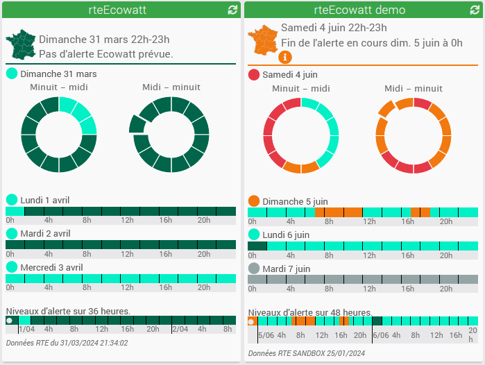

# Rte Ecowatt - Plugin pour Jeedom

Plugin pouvant utiliser les API Rte: Ecowatt, Tempo et Consumption pour exploitation dans Jeedom.

> Pour une procédure d'installation plus détaillée, voir le site [MiniProjets.net](https://miniprojets.net/index.php/2022/10/13/plugin-rteecowatt-ou-comment-preparer-sa-domotique-a-la-reduction-denergie/) Merci à [Ferrader](https://community.jeedom.com/u/ferrader)

## Prérequis chez RTE pour Ecowatt, Tempo et Consommation

Le plugin nécessite un compte sur le site [**data.rte-france**](https://data.rte-france.com) Cliquez sur "Se connecter" pour la création d'un nouveau compte ou l'utilisation d'un compte existant.
- Sur cette page: [**API Ecowatt**](https://data.rte-france.com/catalog/-/api/consumption/Ecowatt/v5.0), cliquez sur "Abonnez-vous à l'API"
- Rattachez ensuite cette API à une application existante ou créez une nouvelle application.
- Pour utiliser Tempo, cliquez sur "Abonnez-vous à l'API" sur la page: [**API Tempo**](https://data.rte-france.com/catalog/-/api/consumption/Tempo-Like-Supply-Contract/v1.1) Rattachez cette API à la même application qu'Ecowatt.
- Pour utiliser Consommation, cliquez sur "Abonnez-vous à l'API" sur la page: [**API Consumption**](https://data.rte-france.com/catalog/-/api/consumption/Consumption/v1.2) Rattachez cette API à la même application qu'Ecowatt.
- Dans la rubrique "Mes applications" cliquez sur votre application. En cliquant sur le bouton "Copier en base 64", vos ID client et ID secret encodés en base 64, pourront être collés dans la configuration du plugin. 

## Aucun prérequis pour EJP et EDF Tempo
Le plugin va chercher les infos [**EJP**](https://particulier.edf.fr/fr/accueil/gestion-contrat/options/ejp.html) 
et [**Tempo**](https://particulier.edf.fr/fr/accueil/gestion-contrat/options/tempo.html#/) sur le site EDF.

## Configuration

Après installation du plugin, il vous suffit de l’activer.
Il apparaitra alors dans le menu *Plugins > Energie*
- Collez l'ID client et l'ID secret encodés en base64 dans la configuration du plugin.

## Utilisation
### Type Ecowatt (RTE):
Créez un équipement. L'affichage est mis à jour au début de chaque heure. Les données se synchronisent chaque heure par le cron dédié. Selon la fréquence à laquelle Rte mettra à jour ses données, (aujourd'hui, c'est une fois par jour car pas d'alerte ), il faudra peut-être corriger la tâche du cron dédié pour s'adapter. 

Utilisez la commande "Valeur maintenant" comme déclencheur de scénario pour créer des alertes ou faire des actions de réduction de votre consommation électrique. Les valeurs possibles de cette commande sont:
- 0 pour le niveau vert foncé: Production décarbonée.
- 1 pour le niveau vert: Consommation normale
- 2 orange: Système électrique tendu. Les écogestes sont les bienvenus 
- 3 rouge: Système électrique très tendu. Coupures inévitables si nous ne baissons pas notre consommation 
- -1 uniquement pour le plugin quand il y a eu un problème de récupération ou quand la valeur n'est pas définie (Ex: la sandbox le 7 juin de 0h à 7h)

Apercu de 2 équipements Ecowatt:

Apercu des différents templates:

Les tuiles en mode demo permettent de tester vos scénarios avant l'arrivée des alertes réelles.

### Type Tempo (RTE):
Créez un équipement. Les données se synchronisent à partir de 10h31 suivant l'horaire défini par la tâche cron pullDataEcowatt. (Rte publie à 10h30).
Le plugin interroge RTE chaque heure entre 10h et 23h jusqu’à ce qu’il obtienne une réponse exploitable en JSON. Dès que la réponse est correcte, le plugin ne réinterroge plus RTE de la journée.

Les commandes pour les scénarios sont Aujourdhui et Demain.
Les valeurs possibles de ces 2 commandes sont: BLUE, WHITE, RED et UNDEFINED.

La commande "Maintenant" peut avoir les valeurs HPJB, HCJB, HPJW, HCJW, HPJR et HCJR suivant l'heure du jour (HP de 6h à 22h, HC de 22h à 6h le lendemain) et la couleur Tempo du jour.

Apercu des différents templates du plugin:

- En haut à gauche, le template Full.
- En haut à droite, pas de template mais le widget cmd.info.string.Widget4JsonCmdByPhpvarious.html affecté à la commande jsonCmdForWidget. Le widget est modifiable via ses paramètres optionnels. Merci David [@Phpvarious](https://github.com/Phpvarious)
- En bas à gauche, le template du plugin. Les informations sont visibles au survol du texte de la couleur actuelle. Les prix sont affichables.
- En bas à droite, la commande jsonCmdForWidget dans un virtuel avec le widget cmd.info.string.TempoPrices.html

### Type Tempo (EDF):
- Ce type d'équipement est obsolète. Les données ne sont plus disponibles chez EDF.
- Le contenu de la tuile est maintenant un message indiquant de passer sur la source Tempo (RTE).

### Type Ejp (EDF):
- Ce type d'équipement est obsolète. Les données ne sont plus disponibles chez EDF.
- Le contenu de la tuile est maintenant un message indiquant la fin de cet équipement.
- Pas de solution de substitution sauf changer le contrat EDF d'EJP en Tempo.

### Type Consommation (RTE)
- Ce type d'équipememnt utilise l'API Consumtion de RTE. Voir les prérequis.
- Les commandes: Consommation réalisée et 3 commandes avec des prévisions de consommation.
- Dans le titre de la fenêtre, un lien vers le site [**éCO2mix**](https://www.rte-france.com/eco2mix) avec des infos intéressantes sur les sources de production, consommation, importation/exportation...

Apercu de l'équipement Consommation aprés quelques jours de fonctionnement le temps que les historiques des commandes se remplissent.

### Guides d'utilisation des APIs:
- [**Ecowatt**](https://data.rte-france.com/catalog/-/api/doc/user-guide/Ecowatt/5.0)
- [**Tempo**](https://data.rte-france.com/catalog/-/api/doc/user-guide/Tempo+Like+Supply+Contract/1.1)
- [**Consumption**](https://data.rte-france.com/catalog/-/api/doc/user-guide/Consumption/1.2)

[Changelog](changelog.md)

