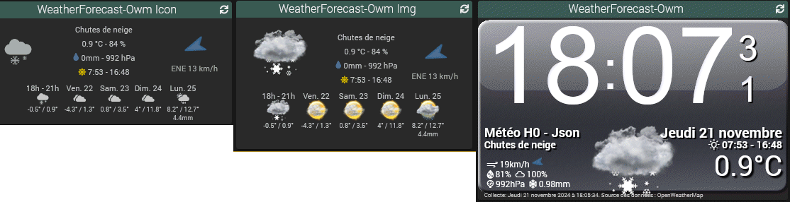
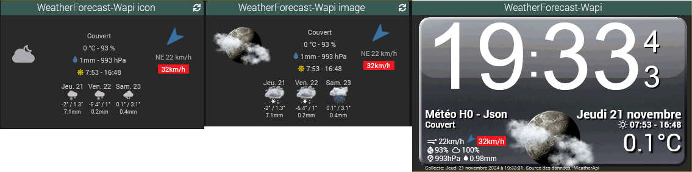

# Weather Forecast - Plugin pour Jeedom

Plugin utilisant OpenWeatherMap ou weatherApi pour afficher les prévisions météo.

## Configuration du plugin

Après installation du plugin, il vous suffit de l’activer.
Il apparaitra alors dans le menu *Plugins > Météo*.

Il est nécessaire de renseigner la clé API correspondant à la source de données utilisée.

## NOTA : Heure de Lever et Coucher du soleil

Elles sont calculées localement par le plugin à partir des coordonnées.

## Configuration pour l'utilisation de la source OpenWeatherMap

Si vous utilisiez le plugin officiel Jeedom weather d'avant avril 2024, vous avez déjà un compte OpenWeatherMap. Il vous suffit de récupérer la clé API à cette adresse : [**OpenWeatherMap.org**](https://home.openweathermap.org/api_keys) et de la coller dans la configuration du plugin.
Le plugin utilise les APIs gratuites "Current Weather Data" et "5 Day / 3 Hour Forecast".
Le plugin fait deux requêtes chaque demi-heure dans les 5 premières minutes.

### Utilisation
- Créez un équipement. 
- Choississez la source de données OpenWeatherMap.
- Renseignez les coordonnées de la localisation désirée. Les coordonnées proposées sont celles renseignées dans la configuration de Jeedom.
- Sélectionnez le template d'affichage. Icônes, Images ou Pas de template
  
  Avec le choix "Pas de template", seule la commande "Météo H0 - Json pour widget" est affichée. Le widget Clock du plugin lui est affecté.

  La partie supérieure des templates Icônes ou Images affiche les données météo de l'heure actuelle. 
  La partie basse fournit les prévisions sur 5 jours à midi pour l'icone et la condition. Les autres données sont relevées(températures min max), cumulées(pluie) dans les 40 prévisions de 3 heures fournies. 
  A partir de 10 heure, la première prévision est la tranche de 3 heures suivant l'heure actuelle.

## Configuration pour l'utilisation de la source weatherAPI

Cette source de données est celle utilisée par le plugin weather officiel actuel mais sans utiliser le cloud Jeedom. Il est donc nécessaire de créer un compte sur le site [**weatherapi.com**](https://www.weatherapi.com/my/) et d'y récupérer la clé API. La création du compte est faite avec une période d'essai avec toutes les fonctionnalités. A la fin de cette période d'essai, le plan Free est automatiquement utilisé.
Le plugin utilise uniquement "Forecast Days". En plan gratuit, il n'y a que 3 jours de prévisions. Le plugin fait une requête chaque quart d'heure. ( Le quota est de 1 million d'appels/mois. )

### Utilisation
- Créez un équipement. 
- Choississez la source de données WeatherAPI.
- Renseignez les coordonnées GPS de la localisation désirée.
- Sélectionnez le template d'affichage. Icônes, Images ou Pas de template
  
  Avec le choix "Pas de template", seule la commande "Météo H0 - Json pour widget" est affichée. Le widget Clock du plugin lui est affecté. ( Idem OpenWeatherMap )

  La partie supérieure des templates Icônes ou Images affiche les données météo de l'heure actuelle. 
  La partie basse fournit les prévisions sur 3 jours fournies par weatherApi sans traitement.
  
